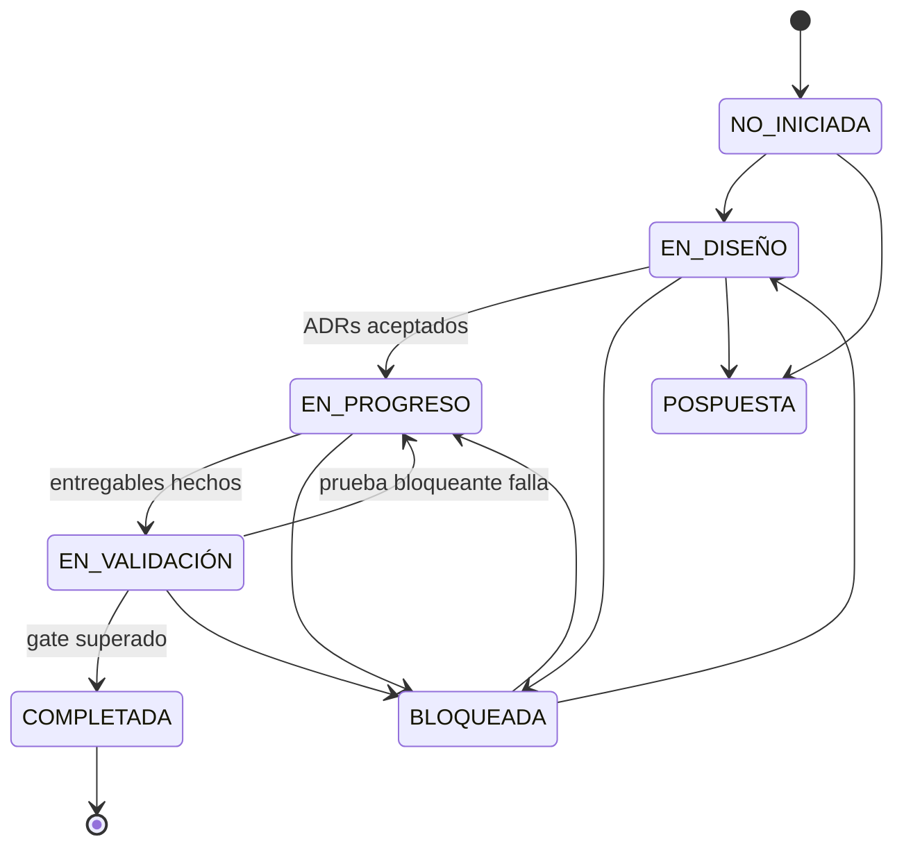
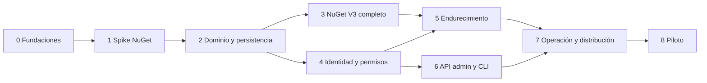

# Roadmap MVP — Registro privado de paquetes NuGet

> Plan por fases derivado de [mvp-registro-privado-paquetes-nuget.md](mvp-registro-privado-paquetes-nuget.md).
> Las decisiones de arquitectura están en [adr-mvp.md](adr-mvp.md).
>
> Última actualización: 2026-10-04

---

## Prueba decisiva del MVP

> Un equipo instala el servidor, configura su proyecto, publica una librería y la restaura desde CI; después revoca una credencial y recupera el servicio desde un backup, **sin abrir una interfaz web ni editar manualmente la base de datos**.

Todas las fases existen para que esa frase sea verificable de punta a punta en la Fase 8.

---

## Sistema de estatus

### Estatus de fase

| Estatus | Significado | Condición para entrar |
|---|---|---|
| ⚪ `NO INICIADA` | Planificada, sin trabajo activo. | Estado inicial. |
| 🔵 `EN DISEÑO` | Se definen alcance fino, ADRs y casos de prueba. Todavía no se escribe código de producto. | Dependencias en `EN VALIDACIÓN` o `COMPLETADA`. |
| 🟡 `EN PROGRESO` | Implementación activa de entregables. | ADRs de la fase en estado `Aceptado` y criterios de aceptación escritos. |
| 🟣 `EN VALIDACIÓN` | Entregables implementados; se ejecutan las pruebas bloqueantes y la revisión del gate. | Todos los entregables marcados como hechos. |
| 🟢 `COMPLETADA` | Gate de salida superado y evidencia registrada. | Todas las pruebas bloqueantes en verde y evidencia enlazada. |
| 🔴 `BLOQUEADA` | No puede avanzar. Debe indicar **motivo**, **condición de desbloqueo** y **responsable**. | Cualquier estado activo. |
| ⚫ `POSPUESTA` | Se saca del MVP de forma deliberada. Requiere ADR o nota de decisión. | Decisión explícita de alcance. |

**Reglas:**

1. Una fase solo pasa a `COMPLETADA` con evidencia enlazada (PR, reporte de pruebas, log de ejecución). "Funciona en mi máquina" no es evidencia.
2. Si una prueba bloqueante falla en `EN VALIDACIÓN`, la fase vuelve a `EN PROGRESO`; no se avanza con excepciones informales.
3. Una fase posterior puede empezar `EN DISEÑO` mientras su dependencia está `EN VALIDACIÓN`, pero no `EN PROGRESO`.
4. `BLOQUEADA` siempre lleva un bloque con: *motivo*, *desde* (fecha), *condición de desbloqueo*, *responsable*.
5. Un cambio que reabre una fase `COMPLETADA` se registra como regresión en la fase actual, no reabriendo la anterior.

### Estatus de entregable

Cada entregable dentro de una fase usa una casilla con marcador:

| Marcador | Significado |
|---|---|
| `[ ]` | Pendiente |
| `[~]` | En curso |
| `[x]` | Hecho (con evidencia) |
| `[!]` | Bloqueado (añadir nota) |
| `[-]` | Descartado / movido fuera de la fase (añadir nota) |

---

## Vista general

| # | Fase | Estatus | Depende de | Gate de salida (resumen) |
|---|---|---|---|---|
| 0 | Fundaciones del proyecto | 🟢 `COMPLETADA` | — | Workspace compila en CI y ADRs base aceptados. |
| 1 | Spike de compatibilidad NuGet | 🟢 `COMPLETADA` | 0 | `dotnet` real publica y restaura contra el servidor; decisión Rust/C# ratificada. |
| 2 | Núcleo de dominio y persistencia | 🟢 `COMPLETADA` | 1 | Publicación consistente, inmutable y resistente a caídas. |
| 3 | Superficie NuGet V3 completa | 🟢 `COMPLETADA` | 2 | Matriz de clientes comprobados en verde. |
| 4 | Identidad, autenticación y autorización | 🟢 `COMPLETADA` | 2 | Feeds aislados en todos los endpoints; tokens revocables. |
| 5 | Endurecimiento frente a paquetes y abuso | 🟢 `COMPLETADA` | 3, 4 | ZIP/XML maliciosos rechazados; bloqueo de versiones operativo. |
| 6 | API administrativa y CLI `onepack` | 🟢 `COMPLETADA` | 4 | Operación completa del registro desde terminal. |
| 7 | Operación, recuperación y distribución | 🟢 `COMPLETADA` | 5, 6 | Backup restaurado en otro servidor; binarios publicados. |
| 8 | Piloto y cierre del MVP | 🟡 `EN PROGRESO` | 7 | Prueba decisiva ejecutada por un equipo real. |

Las fases 3 y 4 pueden avanzar en paralelo. La fase 6 puede avanzar en paralelo con la 5.

---

## Fase 0 — Fundaciones del proyecto

**Estatus:** 🟢 `COMPLETADA` — evidencia: [CI run 37174401011](https://github.com/Khr0x/onepack/actions/runs/37174401011).
**Depende de:** —
**ADRs:** [ADR-001](adr-mvp.md#adr-001), [ADR-003](adr-mvp.md#adr-003), [ADR-019](adr-mvp.md#adr-019)

### Objetivo
Dejar un repositorio donde cualquier cambio se compila, se prueba y se revisa de forma reproducible, y donde las decisiones base están registradas.

### Entregables
- [x] Workspace Cargo con crates vacíos: `core`, `nuget`, `storage`, `api-client`, `server`, `cli` (paquetes `onepack-*`). Fronteras de ADR-003 verificadas por `scripts/check-crate-deps.sh`.
- [x] Estructura de carpetas: `migrations/`, `tests/{integration,conformance-dotnet,security,recovery}`, `packaging/{systemd,container}`, `docs/`.
- [x] CI (`.github/workflows/ci.yml`, runners `ubuntu-24.04`): `cargo fmt --check`, `clippy -D warnings`, `cargo test`, fronteras entre crates, `cargo deny` (licencias, advisories, fuentes). [Verde en GitHub](https://github.com/Khr0x/onepack/actions/runs/37174401011).
- [x] Toolchain fijado (`rust-toolchain.toml`, 1.96.1); MSRV = `rust-version` 1.96, documentado en `docs/conventions.md`.
- [x] Job de CI con SDK .NET 8 que empaqueta las fixtures de `tests/conformance-dotnet/fixtures` (sin ser dependencia del servidor). [Verde en GitHub](https://github.com/Khr0x/onepack/actions/runs/37174401011).
- [x] Convenciones en `docs/conventions.md`: formato de errores, prefijos de códigos, códigos de salida provisionales del CLI, commits y ramas.
- [x] Nombres de binarios confirmados: `onepackd` (servidor) y `onepack` (CLI).
- [x] ADR-001, ADR-003 y ADR-019 en `Aceptado` (2026-10-03); ADR-002 sigue `Condicionado` hasta el gate de la Fase 1.

### Fuera de alcance
Cualquier endpoint funcional.

### Gate de salida
- Un PR de ejemplo pasa todo el pipeline de CI en Linux x86-64.
- ADRs base en `Aceptado`.

---

## Fase 1 — Spike de compatibilidad NuGet

**Estatus:** 🟢 `COMPLETADA` — evidencia: [CI run 37176042099](https://github.com/Khr0x/onepack/actions/runs/37176042099), [informe del spike](../docs/spikes/fase-1-compatibilidad-nuget.md).
**Depende de:** Fase 0
**ADRs:** [ADR-002](adr-mvp.md#adr-002), [ADR-008](adr-mvp.md#adr-008), [ADR-009](adr-mvp.md#adr-009), [ADR-019](adr-mvp.md#adr-019)

### Objetivo
Reducir el mayor riesgo técnico **antes** de invertir en administración, permisos o CLI: demostrar que un servidor Rust mínimo es aceptado por clientes NuGet reales. Esta fase es el punto de decisión para ratificar o revertir Rust frente a C#.

### Entregables
- [x] Servidor Axum mínimo con un feed fijo (`--feed`), sin autenticación, almacenamiento provisional en disco (`crates/server`).
- [x] `index.json` (service index) con solo los recursos implementados; URLs construidas desde `--public-url` (ADR-018).
- [x] `PackagePublish/2.0.0`: `PUT` multipart; `X-NuGet-ApiKey` se acepta sin validar. Acepta `/v2/package` y `/v2/package/` (el cliente añade la barra final).
- [x] `PackageBaseAddress/3.0.0`: lista de versiones en orden NuGet, descarga de `.nupkg` (bytes originales) y `.nuspec`.
- [x] Lectura del `.nuspec` desde el ZIP: id, versión y dependencias por framework (`crates/nuget/src/package.rs`).
- [x] Normalización de id y versión NuGet (`crates/nuget/src/{id,version}.rs`).
- [x] Suite de conformidad: corpus de 168 casos generado con `NuGet.Versioning` 7.9.0 y verificado en CI (`scripts/version-corpus.sh --check`, `crates/nuget/tests/version_corpus.rs`).
- [x] Prueba E2E `scripts/e2e-dotnet.sh`: `dotnet pack` → `dotnet nuget push` → `dotnet restore` con caché aislada → `dotnet run`.
- [x] Informe del spike: [docs/spikes/fase-1-compatibilidad-nuget.md](../docs/spikes/fase-1-compatibilidad-nuget.md).

### Pruebas bloqueantes
| Escenario | Resultado esperado |
|---|---|
| Push y restore con `dotnet` SDK actual | Éxito con caché vacía. |
| Versiones `1.0`, `1.0.0`, `1.0.0.0` | Tratadas como la misma identidad. |
| Prerelease y metadatos de build | Normalización idéntica a `NuGet.Versioning`. |
| Paquete con dependencias por framework | El restore resuelve la dependencia transitiva. |

### Gate de salida
- E2E verde en CI.
- Divergencias de normalización = 0 sobre el corpus de casos.
- ADR-002 pasa de `Condicionado` a `Aceptado` (Rust) **o** se reemplaza por un ADR a favor de C#. Si se cambia de stack, se reescribe este roadmap desde la Fase 2.

---

## Fase 2 — Núcleo de dominio y persistencia

**Estatus:** 🟢 `COMPLETADA` — evidencia: [CI run 37180525028](https://github.com/Khr0x/onepack/actions/runs/37180525028).
**Depende de:** Fase 1
**ADRs:** [ADR-004](adr-mvp.md#adr-004), [ADR-005](adr-mvp.md#adr-005), [ADR-006](adr-mvp.md#adr-006), [ADR-007](adr-mvp.md#adr-007), [ADR-020](adr-mvp.md#adr-020)

### Objetivo
Convertir el spike en un núcleo durable: varios feeds, versiones inmutables, publicación consistente aunque el proceso caiga.

### Entregables
- [x] Esquema SQLite con migraciones SQLx embebidas (`migrations/0001_initial.sql`, tablas `STRICT`): `feed`, `package`, `package_version`, `blob`, `audit_event`.
- [x] `UNIQUE(feed_id, normalized_package_id, normalized_version)` en la base.
- [x] SQLite en WAL, `synchronous=FULL`, `busy_timeout` de 5 s, `foreign_keys`; pool de escritura de una conexión y pool de lectura separado.
- [x] `BlobStore` en filesystem (`crates/storage/src/blobs.rs`): `blobs/sha256/ab/cd/<hash>` y `staging/`, con deduplicación.
- [x] Flujo de publicación: streaming a staging con hash incremental → inspección desde el archivo → `fsync` del archivo → rename atómico → `fsync` de directorios → transacción de metadatos + auditoría.
- [x] Ninguna transacción SQLite abierta durante la subida; la subida no se carga en memoria.
- [x] Conflicto de identidad → `409`; el dominio indica si el contenido es idéntico (`PublishError::Conflict { identical }`) para `--skip-existing-identical`.
- [x] Limpieza de staging y blobs huérfanos con periodo de gracia (`--gc-grace-secs`), al arrancar y periódicamente.
- [x] Verificación al arranque: base inicializada, migraciones pendientes o esquema más nuevo, escritura en el directorio de datos, aviso de poco espacio libre.
- [x] Migraciones forward-only con `onepackd migrate` y copia `VACUUM INTO` previa si ya había datos (ADR-020).
- [x] Separación de crates respetada: `core` sin dependencias externas; `storage` sin `nuget` ni `axum`.
- [x] Gestión de feeds local con `onepackd feed create|list` (la gestión remota llega con la API en la Fase 6).

### Pruebas bloqueantes
| Escenario | Resultado esperado | Prueba |
|---|---|---|
| Dos publicaciones simultáneas de la misma identidad | Solo una confirmada; la otra recibe `409`; sin sobrescritura. | `storage/tests/store.rs` (8 tareas), `server/tests/nuget_api.rs` (6 por HTTP) |
| Kill del proceso durante la subida | No aparece una versión parcialmente disponible. | `server/tests/recovery.rs` (SIGKILL a mitad de subida) |
| Kill entre persistir blob y confirmar BD | Blob huérfano detectado y limpiado tras el periodo de gracia. | `server/tests/recovery.rs` (`abort` inyectado, feature `fault-injection`) |
| Disco lleno durante la subida | Error controlado; ningún metadato apunta a un blob inexistente. | `tests/recovery/disk-full.sh` (tmpfs de 8 MiB, solo Linux/CI) |
| Reinicio tras publicar | Bytes descargados idénticos (hash) a los publicados. | `server/tests/recovery.rs` |
| Mismo paquete en dos feeds | Dos identidades independientes; blob puede deduplicarse. | `storage/tests/store.rs`, `server/tests/nuget_api.rs` |

### Gate de salida
Todas las pruebas bloqueantes automatizadas (tests de los crates y `tests/recovery`) y verdes en CI.

---

## Fase 3 — Superficie NuGet V3 completa

**Estatus:** 🟢 `COMPLETADA` — evidencia: [CI run 37185158143](https://github.com/Khr0x/onepack/actions/runs/37185158143). Las celdas manuales de IDE quedan diferidas al piloto (Fase 8).
**Depende de:** Fase 2
**ADRs:** [ADR-009](adr-mvp.md#adr-009), [ADR-013](adr-mvp.md#adr-013), [ADR-019](adr-mvp.md#adr-019)

### Objetivo
Implementar todos los recursos anunciados con sus requisitos reales y publicar una matriz de clientes comprobados.

### Entregables
- [x] `RegistrationsBaseUrl/3.6.0`: índice, páginas (64 versiones; inline hasta 128) y hojas; grupos de dependencias por framework con `registration` de cada dependencia; rangos; `listed` (`crates/nuget/src/v3.rs`).
- [x] `SearchQueryService`: `q` (términos, `id:`, `packageid:`), `skip`, `take`, `prerelease`, `semVerLevel`, `packageType`; orden estable por relevancia e id.
- [x] `SearchAutocompleteService`: ids (`q`) y versiones de un id (`id`).
- [x] `DELETE` (unlist) y `POST` (relist) en `PackagePublish`, con permiso de publicación sobre el id y auditoría.
- [x] Versiones no listadas: fuera de búsqueda y autocompletado, presentes en flat container y registros (`listed: false`) y descargables.
- [x] SemVer 2.0.0 filtrado según `semVerLevel` (por defecto, solo SemVer 1.0.0).
- [x] URLs absolutas solo desde `public_url`; test con `Host` y `X-Forwarded-*` manipulados y E2E detrás de nginx con TLS.
- [x] Metadatos del `.nuspec` (título, autores, etiquetas, licencia, icono, readme, tipos de paquete…) guardados al publicar (migración 0003) y rellenados al arrancar para versiones anteriores.
- [x] Corpus de paquetes creado con `dotnet pack`: multi-target con dependencias (`Dependent`), rango de dependencia (`Ranged`), prerelease SemVer 2.0.0 con metadatos extensos, icono y readme (`Rich`), y tres versiones de `Basic`.
- [x] Matriz de clientes comprobados en [docs/compatibility.md](../docs/compatibility.md): todas las celdas automáticas en verde; las de IDE (manuales) diferidas al piloto.

### Matriz de clientes objetivo (mínimo)
| Cliente | Plataforma | Operaciones | Prueba |
|---|---|---|---|
| `dotnet` CLI (SDK 10 LTS y 8 LTS anterior) | Linux, macOS, Windows | push, restore, search, list | `scripts/e2e-dotnet.sh` (Linux/macOS, SDK 8 y 10), `e2e-windows.ps1` (SDK 8) |
| `nuget.exe` | Windows | push, restore, search | `tests/conformance-dotnet/e2e-windows.ps1` |
| Visual Studio / Rider | Windows / macOS | navegación y restore (manual, documentado) | manual |
| CI (GitHub Actions / Azure Pipelines) | Linux | restore y push con credenciales inyectadas | jobs de GitHub Actions; Azure Pipelines sin entorno |

### Pruebas bloqueantes
| Escenario | Resultado esperado | Prueba |
|---|---|---|
| Versión no listada | No aparece en búsqueda; sigue restaurable por versión exacta. | `server/tests/catalog.rs`, E2E (`dotnet nuget delete`) |
| Búsqueda paginada con prerelease y SemVer2 | Resultados coherentes con el protocolo. | `server/tests/catalog.rs`, E2E (`dotnet package search`, `nuget.exe search`) |
| Dependencia transitiva con rango | `dotnet restore` resuelve la versión correcta. | E2E: `Ranged` → `Basic` 1.1.0 entre 1.0.0, 1.1.0 y 2.0.0; `nuget.exe install` |
| Detrás de reverse proxy con TLS | URLs del service index correctas. | E2E con nginx + TLS (`ONEPACK_E2E_TLS=1`) y test con cabeceras manipuladas |

### Gate de salida
Matriz de clientes con todas las celdas automatizables en verde en CI y las manuales documentadas con fecha y versión.

---

## Fase 4 — Identidad, autenticación y autorización

**Estatus:** 🟢 `COMPLETADA` — evidencia: [CI run 37182166437](https://github.com/Khr0x/onepack/actions/runs/37182166437).
**Depende de:** Fase 2 (paralelizable con Fase 3)
**ADRs:** [ADR-010](adr-mvp.md#adr-010), [ADR-011](adr-mvp.md#adr-011), [ADR-012](adr-mvp.md#adr-012)

### Objetivo
Autenticación obligatoria y permisos por feed aplicados en **todos** los endpoints, incluidos metadatos, `HEAD` y respuestas condicionales.

### Entregables
- [x] Entidades `principal` (usuario / servicio), `token`, `feed_grant` y `grant_publish_pattern` (`migrations/0002_identity.sql`).
- [x] Tokens opacos `opk_<id>_<secreto>` (256 bits), almacenados como verificador SHA-256 y mostrados una sola vez (`crates/storage/src/tokens.rs`).
- [x] Expiración obligatoria (90 días por defecto), revocación inmediata y `last_used_at` escrito como máximo cada 5 minutos por token.
- [x] Roles por feed: Reader ⊂ Publisher ⊂ Maintainer; Administrator global (`crates/core/src/auth.rs`).
- [x] Restricción de publicación por patrón de id (`Hemia.Payments.*`), comprobada al conocer el id del paquete.
- [x] Mecanismos de autenticación por superficie (ver la precisión en ADR-011):
  - [x] API admin: solo `Authorization: Bearer`.
  - [x] NuGet: Basic con el token como contraseña, o `X-NuGet-ApiKey`; `401` con `WWW-Authenticate: Basic`.
  - [x] Publicación NuGet: `X-NuGet-ApiKey` (o Basic, que el cliente envía tras el `401`).
- [x] Middleware de autenticación único y global (`crates/server/src/auth.rs`), que cubre también rutas inexistentes; los handlers solo obtienen un feed mediante `authorized_feed`, que autoriza a la vez.
- [x] `onepackd init`: migra, crea el administrador y escribe la credencial inicial en `initial-admin-token` (`0600`, directorio `0700`); sin contraseña por defecto.
- [x] Respuesta `404` idéntica para feeds inexistentes y feeds sin permiso de lectura.
- [x] Auditoría de fallos de autenticación, principals, tokens, grants, publicaciones y denegaciones, con el actor.
- [x] Secretos fuera de los logs: las trazas HTTP no registran cabeceras y los rechazos solo registran el id del token.
- [x] Gestión local: `onepackd principal create`, `token create|revoke`, `grant set|remove` (la API remota llega en la Fase 6).
- [x] `GET /api/v1/whoami`: identidad y permisos de la credencial.

### Pruebas bloqueantes
| Escenario | Resultado esperado | Prueba |
|---|---|---|
| Token revocado | La siguiente solicitud recibe `401`. | `server/tests/auth.rs`, E2E con `dotnet` |
| Token expirado | `401`; no se renueva implícitamente. | `server/tests/auth.rs`, `storage/tests/identity.rs` |
| Lectura entre feeds sin permiso | Ninguna filtración vía búsqueda, autocompletado, registros, flat container, `.nuspec` o `HEAD`. | `server/tests/auth.rs` (todas las rutas existentes; búsqueda y registros se cubrirán al añadirlos en la Fase 3) |
| Publisher fuera de su prefijo | `403` con código `AUTH_PREFIX_DENIED`. | `server/tests/auth.rs` |
| Reader intenta publicar o hacer unlist | `403`. | `server/tests/auth.rs` (publicar y unlist) |
| Logs tras flujo completo | No contienen ningún token. | `server/tests/recovery.rs` (`RUST_LOG=trace`), E2E con `dotnet` |
| `dotnet restore` con credenciales por `NuGetPackageSourceCredentials_*` | Éxito. | `scripts/e2e-dotnet.sh` |

### Gate de salida
Test de cobertura de rutas: el 100 % de rutas registradas exige autenticación salvo la lista explícita de rutas públicas (vacía; `anonymous_read` no está implementado).

---

## Fase 5 — Endurecimiento frente a paquetes y abuso

**Estatus:** 🟢 `COMPLETADA`
**Depende de:** Fases 3 y 4
**ADRs:** [ADR-013](adr-mvp.md#adr-013), [ADR-014](adr-mvp.md#adr-014), [ADR-018](adr-mvp.md#adr-018)

### Objetivo
Tratar cada `.nupkg` como contenido no confiable y proteger el servicio frente a saturación.

### Entregables
- [x] Límites configurables: tamaño comprimido, número de entradas ZIP, tamaño descomprimido por entrada y total, tamaño del `.nuspec`, profundidad XML, tiempo de inspección.
- [x] Parser XML sin DTD ni entidades externas.
- [x] Rechazo de rutas peligrosas (`..`, absolutas, nombres reservados) sin extraer a disco.
- [x] Inspección con concurrencia limitada (semáforo) separada del pool que atiende descargas.
- [x] Rate limiting por principal e IP; límite de subidas concurrentes (`max_concurrent_uploads`).
- [x] Cuotas por feed (almacenamiento total, número de versiones).
- [x] Estado `availability: available | blocked` independiente de `listed`; descargas bloqueadas devuelven error explícito.
- [x] Auditoría de bloqueo/desbloqueo con motivo.
- [x] Documentación: el registro no analiza malware ni valida confianza de firmas; un bloqueo no borra copias ya descargadas.

Evidencia: suite [`tests/security`](../tests/security/main.rs), paso de bloqueo con `dotnet restore` en `scripts/e2e-dotnet.sh`, y [docs/security.md](../docs/security.md) (límites, códigos de error y revisión manual).

### Pruebas bloqueantes
| Escenario | Resultado esperado |
|---|---|
| ZIP bomb | Rechazo controlado dentro del presupuesto de memoria/tiempo. |
| XML bomb (billion laughs) | Rechazo controlado. |
| Entrada con path traversal | Rechazo; nada escrito fuera de staging. |
| Ráfaga de subidas | Degradación controlada (`429`/`503`), sin crecimiento ilimitado de tareas. |
| Versión bloqueada | `restore` falla con mensaje claro; sigue visible para administradores. |
| Cuota excedida | `403`/`413` con código específico; nada persistido. |

### Gate de salida
Suite `tests/security` verde en CI y revisión manual de seguridad documentada.

---

## Fase 6 — API administrativa y CLI `onepack`

**Estatus:** 🟢 `COMPLETADA`
**Depende de:** Fase 4 (paralelizable con Fase 5)
**ADRs:** [ADR-015](adr-mvp.md#adr-015), [ADR-016](adr-mvp.md#adr-016)

### Objetivo
Que el registro se opere por completo desde terminal, tanto por personas como por pipelines.

### Entregables — API `/api/v1`
- [x] Endpoints de feeds, principals, tokens, grants, paquetes (listar, inspeccionar, unlist/relist, block/unblock), auditoría.
- [x] Endpoint de capacidades y versión para negociación con el CLI.
- [x] Errores con código estable, mensaje, acción sugerida y `request_id`.
- [x] Paginación por cursor.
- [x] Contrato definido en `api-client` y compartido por servidor y CLI.

### Entregables — CLI
- [x] `onepack context add|list|use|remove`.
- [x] `onepack login|logout` con entrada sin eco o `--token-stdin`; almacenamiento en keychain del SO; error explícito si no hay keychain (sin fallback silencioso a texto plano).
- [x] `onepack feed create|list|show|configure`.
- [x] `onepack principal create|list|disable`, `onepack token create|list|revoke`, `onepack grant add|remove|list`.
- [x] `onepack package list|inspect|push|unlist|relist|block|unblock`, con `--skip-existing-identical`.
- [x] `onepack audit list`.
- [x] `onepack nuget init --dry-run`: genera/actualiza `NuGet.Config` con `packageSourceMapping`, preserva lo existente, muestra diff, no escribe secretos.
- [x] `onepack exec --feed X -- <comando>`: inyecta `NuGetPackageSourceCredentials_*` solo en el entorno del proceso hijo.
- [x] `onepack doctor`: DNS, TLS, autenticación, permisos, service index, `NuGet.Config`, source mapping.
- [x] Transversal: `--json` estable, códigos de salida documentados, `--no-input`, timeouts, datos a stdout y diagnóstico a stderr, confirmación en operaciones destructivas, autocompletado de shell.
- [x] Reintentos solo en operaciones idempotentes.

Evidencia: API en [docs/api.md](../docs/api.md) (contratos en `crates/api-client`), CLI en [docs/cli.md](../docs/cli.md), pruebas `crates/server/tests/admin_api.rs` y `crates/cli/tests/cli.rs` (incluye snapshot del esquema `--json` y servidor N-1), y `scripts/e2e-cli.sh` con `dotnet` real. Guía: [docs/guide-zero-to-ci.md](../docs/guide-zero-to-ci.md).

### Pruebas bloqueantes
| Escenario | Resultado esperado |
|---|---|
| Flujo completo sin UI: feed → principal CI → token → grant → push → restore | Éxito usando solo `onepack` y `dotnet`. |
| `onepack exec -- dotnet restore` | Restaura; el token no aparece en archivos ni en el entorno del shell padre. |
| `nuget init` sobre `NuGet.Config` existente | Conserva fuentes previas; diff mostrado antes de aplicar. |
| `doctor` con token sin permiso de publicación | Reporta `AUTH_SCOPE_MISSING` con acción requerida, sin mostrar el secreto. |
| CLI versión N contra servidor N-1 | Funciona o falla con mensaje de capacidad ausente. |
| Salida `--json` | Validada contra snapshot de esquema. |

### Gate de salida
Guía "de cero a restore en CI" en `docs/` ejecutada literalmente por alguien que no escribió el código.

> Cierre (2026-10-04): la guía se ejecutó literalmente en local y su flujo está automatizado en `scripts/e2e-cli.sh` (verde en CI). La ejecución por alguien que no escribió el código se difiere al piloto de la Fase 8 por decisión del usuario.
---

## Fase 7 — Operación, recuperación y distribución

**Estatus:** 🟢 `COMPLETADA`
**Depende de:** Fases 5 y 6
**ADRs:** [ADR-017](adr-mvp.md#adr-017), [ADR-018](adr-mvp.md#adr-018), [ADR-020](adr-mvp.md#adr-020)

### Objetivo
Que el servicio se pueda instalar, actualizar, observar y recuperar de forma predecible.

### Entregables — Recuperación
- [x] Modo mantenimiento: pausa mutaciones y limpieza de blobs.
- [x] `onepackd backup`: copia consistente de la base (`VACUUM INTO`, ver precisión en ADR-017) + blobs referenciados verificados + manifiesto con hashes. La configuración del servicio no vive en el directorio de datos: se documenta guardarla aparte.
- [x] `onepackd restore` sobre directorio vacío, con verificación del manifiesto.
- [x] `onepackd check`: integridad BD ↔ blobs (faltantes, huérfanos, hashes incorrectos).
- [x] Migraciones: versión de esquema, comprobación previa (`migrate --check`), backup automático antes de migrar, forward-only.

### Entregables — Observabilidad
- [x] Logs estructurados JSON con `request_id`.
- [x] Endpoint de métricas (requests, latencias, subidas, rechazos, espacio en disco).
- [x] `/healthz` (vivo) y `/readyz` (BD y almacenamiento accesibles).

### Entregables — Distribución
- [-] Binarios servidor: Linux x86-64 y ARM64 (estáticos, musl). Workflow `release.yml` listo; primera ejecución diferida a la Fase 8.
- [-] Binarios CLI: Linux, macOS (x86-64/ARM64), Windows. Mismo workflow; primera ejecución diferida a la Fase 8.
- [x] Unidad systemd con hardening (`ProtectSystem`, `NoNewPrivileges`, usuario dedicado).
- [x] Imagen de contenedor opcional (no root, volumen de datos).
- [x] Ejemplos de reverse proxy (Nginx/Caddy) que **no** sirven blobs directamente.
- [-] Checksums y firma de los artefactos de release (SHA-256 + cosign keyless, verificada en el propio workflow). Primera ejecución diferida a la Fase 8.

### Entregables — Rendimiento
- [x] Benchmark reproducible en 2 vCPU / 1 GB / SSD (`scripts/bench.py --docker`, job *Benchmark* del CI).
- [x] Medición de objetivos: arranque < 2 s, RSS en reposo < 100 MiB, p95 metadatos < 50 ms, memoria acotada en transferencias.
- [x] Reporte con resultados reales (los objetivos no cumplidos se documentan, no se ocultan).

Evidencia: `crates/storage/tests/ops.rs`, `crates/server/tests/operations.rs`, `scripts/e2e-recovery.sh` (backup en Linux → restore en macOS en el CI), `tests/ops/` (systemd, contenedor, proxies), [docs/performance.md](../docs/performance.md) y [docs/runbooks/](../docs/runbooks/).

### Pruebas bloqueantes
| Escenario | Resultado esperado |
|---|---|
| Backup → restore en otro servidor → `dotnet restore` | El proyecto restaura sus dependencias. |
| Blob eliminado manualmente | `onepackd check` lo detecta y lo reporta. |
| Actualización N-1 → N con migración | Datos intactos; backup previo generado. |
| Reinicio por systemd tras crash | Servicio vuelve a `ready` sin intervención. |

### Gate de salida
Prueba de recuperación ejecutada en infraestructura distinta de la original y documentada en `docs/runbooks/`.

> Cierre (2026-10-04): gate superado en CI, con backup en Linux y restore + `dotnet restore` en macOS (otra máquina y otro sistema operativo). Por decisión del usuario, se difieren a la Fase 8 la primera ejecución de `release.yml` y la transcripción a `docs/performance.md` de los resultados del benchmark en contenedor (2 vCPU / 1 GiB), que están en el resumen del job *Benchmark* del CI.
---

## Fase 8 — Piloto y cierre del MVP

**Estatus:** 🟡 `EN PROGRESO` — rama `feature/phase-8-pilot`. Material del piloto en [docs/pilot](../docs/pilot/README.md).
**Depende de:** Fase 7

### Objetivo
Validar con un equipo real que el producto resuelve el problema y ejecutar la prueba decisiva.

### Entregables
- [x] Prueba decisiva automatizada de punta a punta ([`scripts/e2e-decisive.sh`](../scripts/e2e-decisive.sh)): instalar, configurar, publicar, restaurar desde CI, revocar y rotar la credencial, bloquear una versión y recuperar desde backup, sin UI ni acceso a la base de datos. En CI (SDK 8 y 10, Linux y macOS) y en `release.yml` contra los binarios de release.
- [x] Material del piloto: [plan](../docs/pilot/README.md), [registro de fricciones](../docs/pilot/friction-log.md), [ejercicio de incidente](../docs/runbooks/incident-drill.md) y [procedimiento de release](../docs/runbooks/release.md).
- [ ] Licencia del proyecto decidida y añadida (`LICENSE`), requisito para `v0.1.0`. Decisión del usuario.
- [ ] Equipo piloto identificado (p. ej., un equipo de Hemia) con al menos una librería y un pipeline de CI.
- [ ] Instalación hecha por el equipo piloto siguiendo solo la documentación.
- [ ] Uso en builds y publicaciones habituales durante un periodo acordado (p. ej. 2–4 semanas).
- [ ] Ejercicio de incidente: revocar credencial de CI, bloquear una versión, restaurar desde backup.
- [ ] Verificación manual con Visual Studio y Rider (diferida desde la Fase 3), anotada en `docs/compatibility.md`.
- [ ] Ejecución literal de la guía [de cero a restore en CI](../docs/guide-zero-to-ci.md) por alguien que no escribió el código (diferida desde la Fase 6).
- [ ] Primera ejecución de `release.yml` (binarios, checksums y firma) antes de etiquetar `v0.1.0` (diferida desde la Fase 7).
- [ ] Resultados del benchmark en contenedor (2 vCPU / 1 GiB) del job *Benchmark* anotados en `docs/performance.md` (diferido desde la Fase 7).
- [ ] Registro de fricciones, errores y peticiones; clasificación en "bloqueante MVP" / "post-MVP".
- [ ] Corrección de todos los bloqueantes MVP.
- [ ] Retrospectiva y actualización del orden de evolución (credential provider, S3, proxy…).

### Criterios de cierre del MVP
- [ ] La prueba decisiva se ejecuta completa sin UI ni edición manual de BD.
- [ ] Cero incidencias abiertas de pérdida o corrupción de datos.
- [ ] Cero filtraciones entre feeds conocidas.
- [ ] Matriz de clientes y documentación de operación actualizadas.
- [ ] Release `v0.1.0` etiquetada con binarios firmados.

---

## Fuera del MVP (referencia)

Registrado para evitar que entre por la puerta de atrás. Cualquier inclusión requiere un ADR nuevo.

| Funcionalidad | Etapa prevista |
|---|---|
| Credential provider NuGet, importación de paquetes, almacenamiento S3 | Primera evolución |
| Proxy/caché de nuget.org con reglas de procedencia | Segunda evolución |
| npm | Tercera evolución |
| Símbolos, PyPI, SSO, interfaz web | Según demanda |
| PostgreSQL, multinodo, alta disponibilidad | Solo con necesidad demostrada |

---

## Registro de cambios de estatus

| Fecha | Fase | De | A | Nota / evidencia |
|---|---|---|---|---|
| 2026-10-03 | 0 | `NO INICIADA` | `EN DISEÑO` | Roadmap y ADRs iniciales redactados. |
| 2026-10-03 | 0 | `EN DISEÑO` | `EN PROGRESO` | ADR-001, 003 y 019 aceptados; binarios `onepackd`/`onepack`. |
| 2026-10-03 | 0 | `EN PROGRESO` | `EN VALIDACIÓN` | Entregables implementados; checks verdes en local. Pendiente: CI en GitHub. |
| 2026-10-04 | 0 | `EN VALIDACIÓN` | `COMPLETADA` | Gate superado: [CI run 37174401011](https://github.com/Khr0x/onepack/actions/runs/37174401011). Runner fijado en `ubuntu-24.04` (con `ubuntu-latest` los jobs no recibían runner). |
| 2026-10-04 | 1 | `NO INICIADA` | `EN DISEÑO` | Dependencia (Fase 0) completada. |
| 2026-10-04 | 1 | `EN DISEÑO` | `EN PROGRESO` | ADR-008 y ADR-009 aceptados. |
| 2026-10-04 | 1 | `EN PROGRESO` | `EN VALIDACIÓN` | Corpus sin divergencias y E2E verde en local. Pendiente: CI en GitHub. |
| 2026-10-04 | 1 | `EN VALIDACIÓN` | `COMPLETADA` | Gate superado: [CI run 37176042099](https://github.com/Khr0x/onepack/actions/runs/37176042099) (corpus + E2E con dotnet). ADR-002 aceptado (Rust). PR Khr0x/onepack#2. |
| 2026-10-04 | 2 | `NO INICIADA` | `EN DISEÑO` | Dependencia (Fase 1) completada. |
| 2026-10-04 | 2 | `EN DISEÑO` | `EN PROGRESO` | ADR-004, 005, 006, 007 y 020 aceptados. |
| 2026-10-04 | 2 | `EN PROGRESO` | `EN VALIDACIÓN` | 37 tests y E2E con dotnet verdes en local. Pendiente: CI (incluye disco lleno en Linux). |
| 2026-10-04 | 2 | `EN VALIDACIÓN` | `COMPLETADA` | Gate superado: [CI run 37180525028](https://github.com/Khr0x/onepack/actions/runs/37180525028), con tests de recuperación (`fault-injection`) y disco lleno en tmpfs. |
| 2026-10-04 | 3 | `NO INICIADA` | `EN DISEÑO` | Dependencia (Fase 2) completada. |
| 2026-10-04 | 4 | `NO INICIADA` | `EN DISEÑO` | Dependencia (Fase 2) completada; paralelizable con la Fase 3. |
| 2026-10-04 | 4 | `EN DISEÑO` | `EN PROGRESO` | ADR-010, 011 y 012 aceptados. |
| 2026-10-04 | 4 | `EN PROGRESO` | `EN VALIDACIÓN` | 66 tests y E2E autenticado con dotnet verdes en local. Pendiente: CI. |
| 2026-10-04 | 4 | `EN VALIDACIÓN` | `COMPLETADA` | Gate superado: [CI run 37182166437](https://github.com/Khr0x/onepack/actions/runs/37182166437), con cobertura de rutas, aislamiento entre feeds y E2E autenticado. |
| 2026-10-04 | 6 | `NO INICIADA` | `EN DISEÑO` | Dependencia (Fase 4) completada; paralelizable con la Fase 5. |
| 2026-10-04 | 3 | `EN DISEÑO` | `EN PROGRESO` | ADR-013 aceptado. |
| 2026-10-04 | 3 | `EN PROGRESO` | `EN VALIDACIÓN` | Tests y E2E con SDK 8 verdes en local. Pendiente: matriz en CI (SDK 8/10, macOS, Windows, TLS) e IDE manuales. |
| 2026-10-04 | 3 | `EN VALIDACIÓN` | `COMPLETADA` | Matriz automática en verde: [CI run 37185158143](https://github.com/Khr0x/onepack/actions/runs/37185158143). Cerrada por decisión del usuario con las celdas manuales de IDE (Visual Studio, Rider) diferidas al piloto de la Fase 8. |
| 2026-10-04 | 5 | `NO INICIADA` | `EN DISEÑO` | Dependencias (Fases 3 y 4) completadas. |
| 2026-10-04 | 5 | `EN DISEÑO` | `EN PROGRESO` | ADR-014 y ADR-018 aceptados. Rama `feature/phase-5-hardening` (desde esta fase, ramas git flow en inglés). |
| 2026-10-04 | 5 | `EN PROGRESO` | `EN VALIDACIÓN` | Suite `tests/security` (16 pruebas) y E2E con bloqueo verdes en local; revisión manual en `docs/security.md`. Pendiente: CI. |
| 2026-10-04 | 5 | `EN VALIDACIÓN` | `COMPLETADA` | Gate superado: [CI run 37232454014](https://github.com/Khr0x/onepack/actions/runs/37232454014), con el paso "Security suite" y el E2E de bloqueo en toda la matriz (SDK 8/10, Linux con TLS, macOS, Windows). Revisión manual de seguridad en `docs/security.md`. PR Khr0x/onepack#6. |
| 2026-10-04 | 6 | `EN DISEÑO` | `EN PROGRESO` | ADR-015 y ADR-016 aceptados. Rama `feature/phase-6-admin-api-cli`. |
| 2026-10-04 | 6 | `EN PROGRESO` | `EN VALIDACIÓN` | API `/api/v1` y CLI completos; 142 tests, `e2e-cli.sh` y la guía ejecutados en local (SDK 8). Pendiente: CI y que la guía la ejecute literalmente alguien que no escribió el código. |
| 2026-10-04 | 6 | `EN VALIDACIÓN` | `COMPLETADA` | CI en verde: [CI run 37236552774](https://github.com/Khr0x/onepack/actions/runs/37236552774), con `e2e-cli.sh` en Linux (SDK 8 y 10) y macOS (SDK 8 y 10). Cerrada por decisión del usuario con la ejecución de la guía por un tercero diferida al piloto de la Fase 8. PR Khr0x/onepack#7. |
| 2026-10-04 | 7 | `NO INICIADA` | `EN DISEÑO` | Dependencias (Fases 5 y 6) completadas. |
| 2026-10-04 | 7 | `EN DISEÑO` | `EN PROGRESO` | ADR-017 aceptado. Firma de releases: SHA-256 + cosign keyless. Rama `feature/phase-7-operations`. |
| 2026-10-04 | 7 | `EN PROGRESO` | `COMPLETADA` | CI en verde: [CI run 37247176082](https://github.com/Khr0x/onepack/actions/runs/37247176082), 11 jobs: recuperación Linux → macOS con `dotnet restore`, systemd con reinicio tras SIGKILL, contenedor, proxies y benchmark. Cerrada por decisión del usuario; se difieren a la Fase 8 la primera ejecución de `release.yml` y los números del benchmark en contenedor. PR Khr0x/onepack#8. |
| 2026-10-04 | 8 | `NO INICIADA` | `EN DISEÑO` | Dependencia (Fase 7) completada. |
| 2026-10-04 | 8 | `EN DISEÑO` | `EN PROGRESO` | Sin ADRs nuevos. Rama `feature/phase-8-pilot`: prueba decisiva automatizada y material del piloto. Primera fricción (F-001, bloqueante) corregida: `onepack exec` comprueba la credencial antes de lanzar `dotnet`. |
